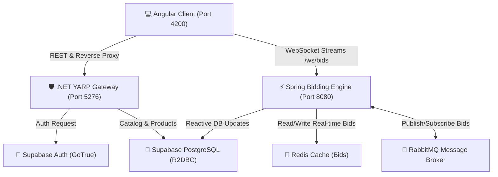

# 🌌 Omni-Market: Real-Time Auction & Bidding Suite

Omni-Market is a high-performance, real-time distributed auction system designed for ultra-low latency, responsive bidding mechanics, and seamless user experiences. Engineered as a cohesive microservices monorepo, it integrates Angular, .NET 8, and Spring Boot to deliver state-of-the-art live auction services.

---

## 🏗️ System Architecture & Data Flow

Below is the high-level architecture diagram showing how traffic flows through the reverse-proxy gateway, real-time WebSocket messaging layer, caching engines, and state database.



---

## ✨ Key Completed Features

Here is a summary of the fully implemented and ready-to-run features in this workspace:

### 1. 🌌 Futuristic Cyber-Dark Glassmorphic Landing
*   **Immersive Welcome Page:** Land on a custom glassmorphism welcome page at `localhost:4200` built with harmony-tailored HSL colors, smooth fade-in gradients, and hover transitions.
*   **Dynamic Responsive Navbar:** Displays navigation links dynamically based on user session status and role (Sellers see different dashboard options compared to Bidders; unauthenticated users see clean Sign In/Sign Up options).

### 2. 📈 Integrated Seller & Bidding Dashboards
*   **Product Listings & Additions:** Sellers can add new auction items (name, description, starting price, image URL) and view them immediately.
*   **"Go Live" Auction Publisher:** Single-click capability to put a listed product directly into the active bidding pool, setting bidding duration and starting bids dynamically.
*   **Live Bid Tracking:** Bidders view active auctions and track live, flashing price updates streamed directly via WebSockets.

### 3. 🛡️ Escrow Protection & Shill Bidding Block
*   **Self-Bidding Prevention:** Complete application-level lock that prevents Sellers from bidding on their own products. 
*   **Contextual Banner warning:** Bidding input controls are cleanly disabled for a product's owner, displaying a high-contrast escrow warning badge, while allowing them to bid on other catalog items.

### 4. 🎛️ One-Click Unified Orchestrator (Startup / Teardown)
*   **Zero-Overhead Startup (`start-all.bat` / `start-all.ps1`):** A single script launches the Docker infrastructure, compiles and starts the Spring Boot microservice, boots the .NET API Gateway, and launches the Angular app in the background. 
*   **Elegant Teardown (`stop-all.bat` / `stop-all.ps1`):** Instantly kills and cleans up background service ports (`8080`, `5276`, `4200`, `6379`, `5672`), freeing system memory.
*   **Unified Logger:** All stdout and stderr output is elegantly routed to isolated files inside a central `logs/` directory for noise-free development.

---

## 🔒 Security & Environment Design (.env & .gitignore)

To prepare for a secure Git push to your repository, all sensitive configurations have been completely decoupled from the codebase:
1.  **Unified Credentials Management:** A root-level `.env` stores your Supabase credentials, PostgreSQL database passwords, and API keys.
2.  **Robust Startup Loading:** The batched startup utilities parse this root `.env` and inject environment variables dynamically into each service's process scope on launch.
3.  **Spring Boot Parameterization:** The Spring microservice `application.yaml` is fully parameterized to read DB passwords and Auth keys dynamically from process environment parameters (`${SUPABASE_DB_PASS}`, `${SUPABASE_URL}`, etc.), falling back to local credentials only if not provided.
4.  **Bulletproof Ignored Patterns:** The root `.gitignore` excludes all `.env` files recursively (`**/.env`), local environments (`**/.env.local`), Docker log layers, built compilation structures (`/bin`, `/obj`, `/target`, `/node_modules`), and raw runtime logs (`/logs/*.log`).

---

## 🚀 Getting Started

### 📋 Prerequisites
*   **Node.js & npm** (Angular execution)
*   **.NET SDK 8.0** (.NET Gateway)
*   **Java 21 & Maven** (Spring Boot Bidding Engine)
*   **Docker Desktop** (Redis & RabbitMQ containers)

### ⚙️ Quick Setup

1.  **Create Root Environment Configuration:**
    Create a `.env` file at the root of the project with the following keys (do not commit this file!):
    ```env
    SUPABASE_URL=https://your-supabase-url.supabase.co
    SUPABASE_KEY=your-supabase-anon-key
    SUPABASE_DB_PASS=your-supabase-db-password
    ```

2.  **Launch All Services (One Command):**
    Open a terminal at the project root and execute the startup launcher:
    
    *   **On Windows (CMD/Batch):**
        ```cmd
        start-all.bat
        ```
    *   **On Windows (PowerShell):**
        ```powershell
        .\start-all.ps1
        ```
    
    This will spin up:
    *   **Docker Infrastructure** (Redis cache & RabbitMQ queue in the background)
    *   **Spring Boot Bidding Engine** (Running silently in background; logs in `logs/spring-bidding.log`)
    *   **.NET Core Gateway** (Running silently in background; logs in `logs/dotnet-gateway.log`)
    *   **Angular Frontend** (Running silently in background; logs in `logs/angular-frontend.log`)

3.  **Explore the System:**
    *   Open your browser to: **`http://localhost:4200`**
    *   Explore live WebSocket updates: `ws://localhost:8080/ws/bids`
    *   Monitor broker channels: `http://localhost:15672` (RabbitMQ dashboard)

4.  **Graceful Shutdown:**
    When finished, shut down all services and clean up ports by running:
    *   **Batch:** `stop-all.bat`
    *   **PowerShell:** `.\stop-all.ps1`

---

## 📂 Project Monorepo Structure

```text
omni-market/
├── .env                              # Master secrets file (GIT-IGNORED)
├── .gitignore                        # Global ignore policies (bin, obj, target, envs, logs)
├── docker-compose.yml                # Redis & RabbitMQ orchestration specs
├── start-all.bat / start-all.ps1     # Unified microservices background startups
├── stop-all.bat / stop-all.ps1       # Clean shutdown & port releasing orchestrators
│
├── identity-gateway-dotnet/          # .NET Core 8 Identity & Product Services
│   └── identity-gateway-dotnet/
│       └── OmniMarket.Gateway/       # YARP Reverse Proxy & Supabase Catalog API
│
├── bidding-engine-spring/            # Reactive WebSocket Spring Boot Bidding Engine
│   └── src/main/resources/
│       └── application.yaml          # Configured to load credentials dynamically
│
└── omni-market-angular/
    └── omni-market-frontend/         # Angular 17 Glassmorphic User Interface
```

---
*Created with 💙 for the Omni-Market community. Fully prepared for Git deployment.*